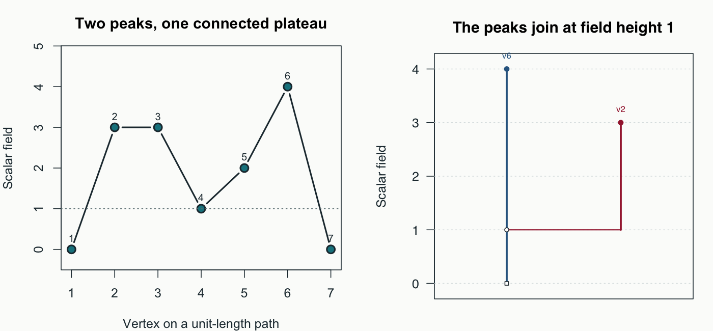

# gflow

Explore how scalar fields rise, form basins, and change together on a graph.
`gflow` helps you follow peaks, overlapping supports, and trajectories in
structured data, and compare local changes between fields.



**Two peaks, one hierarchy.** The plateau peak is born at height 3 and joins the
higher peak at height 1. The tree records this relationship; its branch
lifetimes are in field units, not significance scores.
[Reproduce the figure](https://github.com/pgajer/gflow/blob/main/tools/render_basin_showcase.R) ·
[Start an analysis](https://pgajer.github.io/gflow/articles/function-guide.html) ·
[Explore the example graphs](https://pgajer.github.io/gflow/articles/example-graphs-and-fields.html)

## Install with help and guides

This is the unreleased 0.2.0 development package. Build from a source checkout
with R, a C++17 compiler, GNU make, and Pandoc (also supplied with RStudio).
R >= 4.1.0 and `dgraphs` >= 0.2.0 are required. The graph boundary supports
both the published 0.2.0 list API and the tested 0.3.0.9000 object API.

```sh
git clone https://github.com/pgajer/gflow.git
cd gflow
make install-user
```

This installs missing core/build R dependencies, generates function help,
builds all four vignettes, installs the source archive, and checks the installed
introduction. It uses your current R library configuration. For a library you
control, create a directory and set `R_LIBS_USER` before running the command.
Optional viewers and archived modeling packages are not needed for this route.

Then, in R:

```r
help("gflow-package", package = "gflow")
vignette("function-guide", package = "gflow")
```

A plain Git/local installation that skips the Makefile's documentation step
can omit generated help and rendered guides. Use the route above, or install a
source archive produced by `make build`. See [installation details](https://github.com/pgajer/gflow/blob/main/INSTALL.md)
for manual steps, library selection, and optional OpenMP toolchains.

## A first result

This small example reproduces the structure in the opening figure. Each
adjacency entry has an aligned list of edge lengths; the field has one value
per vertex in the same order.

```r
library(gflow)
adjacency <- list(2L, c(1L, 3L), c(2L, 4L), c(3L, 5L),
                  c(4L, 6L), c(5L, 7L), 6L)
edge_lengths <- lapply(adjacency, function(v) rep(1, length(v)))
field <- c(0, 3, 3, 1, 2, 4, 0)
bc <- create.basin.complex(
  adjacency, edge_lengths, field,
  method = "superlevel_merge_tree", direction = "max"
)
get.basin.table(bc)[, c("extremum.vertex", "persistence", "raw.support.size")]
```

| Peak vertex | Persistence (field units) | Raw support (vertices) |
|---|---:|---:|
| 2 (plateau at 2–3) | 2 | 2 |
| 6 | 4 | 7 |

The root support includes the younger branch, so these supports overlap.
Change the field and reconstruct `bc` to see how the hierarchy changes.

```r
summary(bc)                         # Rankings, coverage, and diagnostics
get.basin.membership(bc)             # Raw overlapping membership
get.basin.assignment(bc)             # Current single labels, when available
plot(bc, view = "merge_tree", type = "tree",
     label = "extremum.vertex", show.mass = FALSE, show.support = FALSE)
```

For graph maps, supply drawing coordinates to `plot(bc, view = "assignment",
coordinates = xy)` or `view = "overlap"`. `plot(bc)` shows the input field
against vertex index. A drawing does not change the analysis.

## Choose the next task

| Task | Start with | Guide |
|---|---|---|
| Choose a basin definition | `create.basin.complex()` | [Canonical workflow](https://pgajer.github.io/gflow/articles/basin_complex_workflow_vignette.html) |
| Understand overlap, cuts, and refinement | `get.basin.*()`, `cut()`, `summary()` | [Paths, grids, and disconnected graphs](https://pgajer.github.io/gflow/articles/example-graphs-and-fields.html) |
| Follow trajectories or extend coordinates | `construct.madag()`, `compute.harmonic.extension()` | [Task map](https://pgajer.github.io/gflow/articles/function-guide.html) |
| Compare local changes between fields | `lcor()`, `lslope()`, `lslope.neighborhood()` | [Noisy-circle workflow](https://pgajer.github.io/gflow/articles/noisy_circle_core_workflow_vignette.html) |

[Function reference](https://pgajer.github.io/gflow/reference/index.html) ·
[Full task and API catalog](https://pgajer.github.io/gflow/articles/function-guide.html) ·
[Guide sources](https://github.com/pgajer/gflow/tree/main/vignettes) · [Release notes](https://github.com/pgajer/gflow/blob/main/NEWS.md)

All four guides are installed locally. Use `browseVignettes("gflow")` for the
index and `help("gflow-migration", package = "gflow")` for migration advice.
Loading the package stays quiet.

## Package boundaries

Build graphs with [`dgraphs`](https://github.com/pgajer/dgraphs), then supply
adjacency and aligned edge lengths. `gflow` owns basin/flow analysis and local
association. Layout and interactive viewers are optional and separate.
Retired response-smoothing estimators are archived in
[`gflowx`](https://github.com/pgajer/gflowx).

`gfcor()` and `gfassoc.membership()` currently require compatible archived
basin objects and reject canonical `basin_complex` inputs. They are not a
continuation of the new-analysis example above. See [REFERENCE.md](https://github.com/pgajer/gflow/blob/main/REFERENCE.md)
and the [migration guide](https://pgajer.github.io/gflow/reference/gflow-migration.html).

## Development and documentation

```sh
make document
make audit-api-guide
make check
make audit-final-acceptance
```

To rebuild the website from a matching installed archive, install `pkgdown`
and run `make website` with the same `R_ENV` library selection used to install
that archive. Generated pages live in `build/site/`; maintained installation
notes in `docs/` are preserved. See [the documentation build guide](https://github.com/pgajer/gflow/blob/main/docs/documentation-build.md).

The [developer map](https://github.com/pgajer/gflow/blob/main/docs/development-map.md) locates implementations, scientific
regression tests, ownership records, and resource limits.
